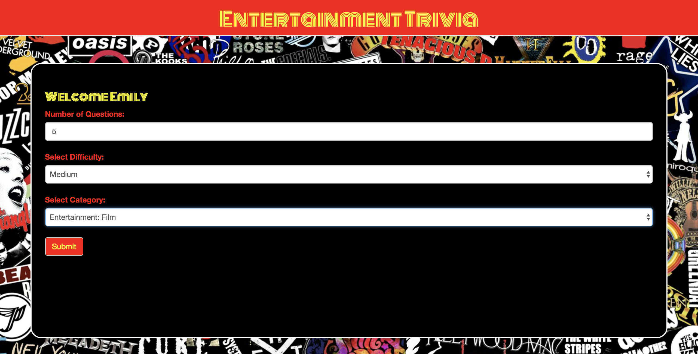
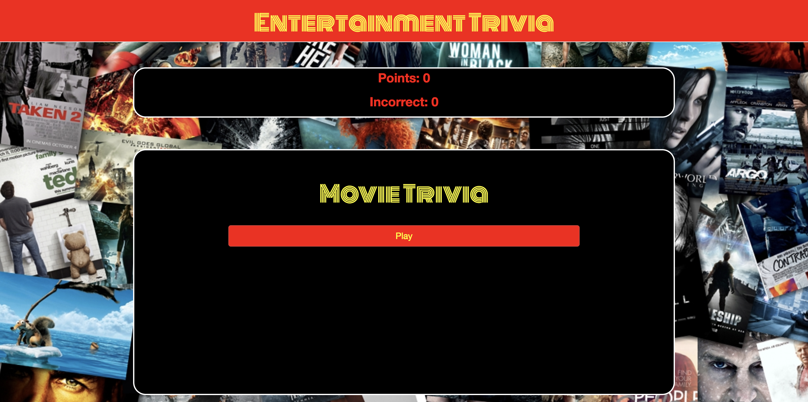
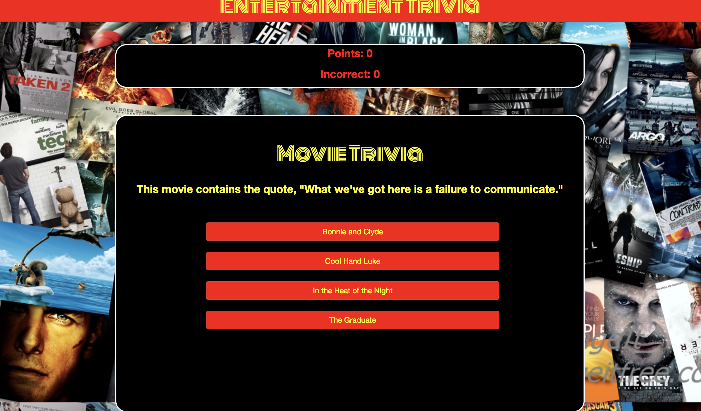
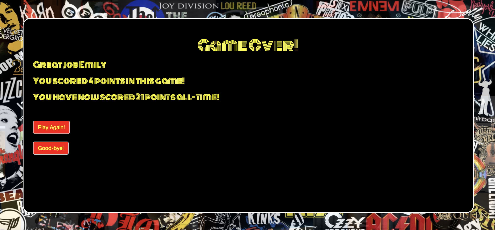

# Entertainment Trivia

**Project Description**

A trivia game with multiple entertainment categories and levels of difficulty. This app utilizes JQuery and the Open Trivia API to dynamically create questions, as well as Firebase for user authentication and data storage. The front end is built with Bootstrap, HTML5, and CSS3.

 
 

**Instructions**

1.	*Create an account and sign in.*

2.	*Once a user is signed in, they will be prompted to select the number of questions they would like to be asked, the level of difficulty (correctly answered easy questions will give a user 1 point, correctly answered medium questions will give a user 2 point and correctly answered hard questions will give a user 3 points), as well as the the genre of the questions(users can choose either film, television, or music).*

3.	*Users will then be prompted to press the **Play** button to begin the game.*

4.	*At the end of the game the user will be told the number of points they received in their last round, as well as their all time, cumulative score.*

 
 

**Responsibilities**

*Aaron Silverstein*  *– Handled the Open Trivia API, built the UI, and wrote the game logic.*

*Chae Kim* *– Handled backend logic for Firebase authentication.* 

*Chandani Rana* – *Assisted with Front end development.* 

 
 

**Link to Website**
[Entertainment Trivia](https://chaehkim.github.io/TeamTrioProject/)